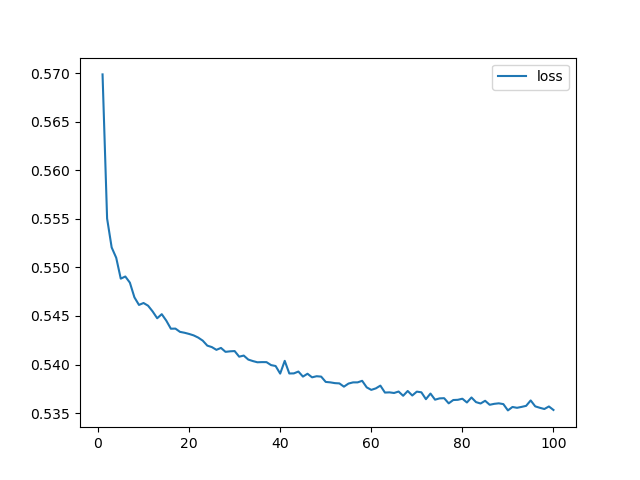
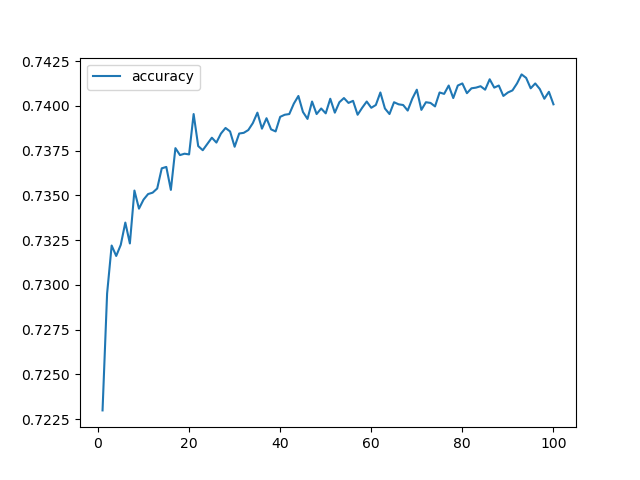

# deep-learning-challenge
Module 21 Challenge Files

### Overview
The purpose of this code is to create a model to assist the nonprofit Alphabet Soup selct applications for funding. The model is based on data provided by Aphabet Soup and uses a neural network model to create a predictive analysis. The model uses a target value and creates two datasets, a training and test set. The results are compared to determine the most successfully optimizated model. 

### Results
The models were optimized by adjusting the number of neurons per layer, changing the activation type, adding a third hidden layer, and removing the column "SPECIAL_CIRCUMSTANCES". The model was run 4 times making adjustments each time as shown below. The best results in all 4 optimization models was accuracy of 72.61% and loss of 56.02%. No attempt hit the target value of 75% accuracy.
 - Target: The target value is the "Is_Successful" column. 
 - Feature: variables are Application Type, Affiliation, Classification, Use Case, Organization, Status, Income Amt, Special Considerations(dropped to attempt to optmimize the data), and Ask Amount. EIN and NAME columns were dropped because they were neither targets nor features. 

**First_Model_AlphabetSoupCharity_Optimization.ipynb**

Setup: Drop "SPECIAL_CONSIDERATIONS" column
 - 2 Hidden Layers, 50 & 20 Neurons, relu
 - 1 output layer, sigmoid
 - 100 Epochs

Results: 
 - accuracy: 0.7261
 - loss: 0.5602
 - The high loss rate could indicate underfitting the model. Try again.

**Second_Model_AlphabetSoupCharity_Optimization.ipynb**

Setup: use more neurons
 - 2 Hidden Layers, 80, 50, activation relu
 - 1 output layer, sigmoid

Results:
 - accuracy: 0.7261
 - loss: 0.5602
 - The results are the same. Try again. 

**Third_Model_AlphabetSoupCharity_Optimization.ipynb**

Setup: use tanh activation 
 - 3 Hidden Layers, 80, 50, activation tanh
 - 1 output layer, sigmoid

Results:
 - accuracy: 0.7245
 - loss: 0.5595
 - The results are even farther from the target value of 75% accuracy. Try again. 

**Fourth_Model_AlphabetSoupCharity_Optimization.ipynb**

Setup: use tanh activation s
 - 3 Hidden Layers, 80, 50, activation relu
 - 1 output layer, sigmoid

Results:
 - accuracy: 0.7256
 - loss: 0.5637
 - The results with 3 hidden are farther from the target than 2 hidden layers. 

## Summary
The neural network model failed to meet the target of 75% in all 4 trials. A different model should be developed for this dataset. A Random Forest model might work better for this dataset that has many features and lots of noise. 

